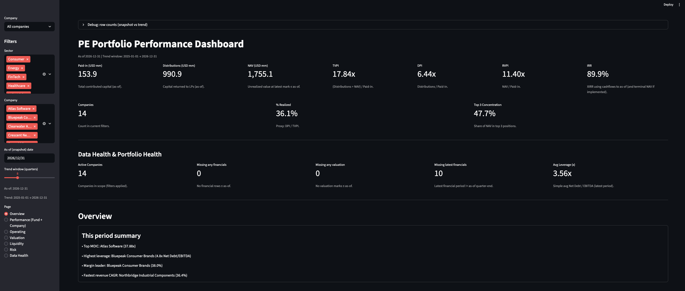
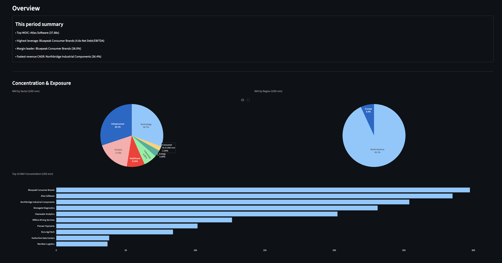
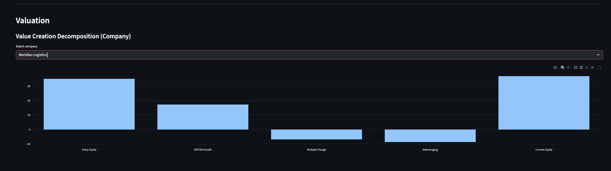
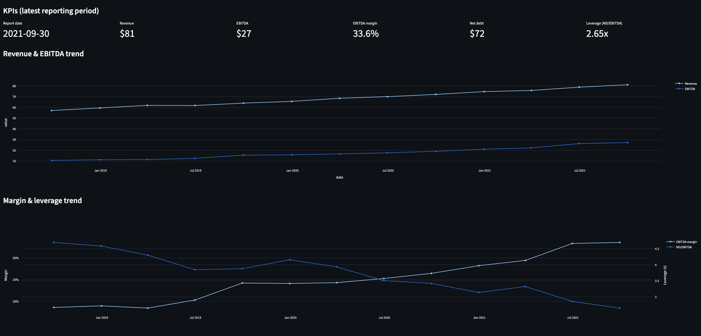
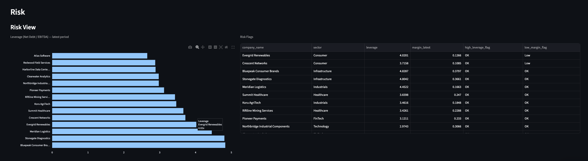

# 📊 PE Portfolio Performance Dashboard


---

## 🧠 Overview

The **PE Portfolio Performance Dashboard** is a **Private Equity–style portfolio monitoring tool** designed to mirror how institutional PE firms track:

- Fund performance
- Portfolio company operating health
- Value creation drivers
- Cashflow accuracy
- Risk and leverage exposure

It follows **standard PE conventions** used by investment teams for portfolio reviews, IC validation, and ongoing asset monitoring.

---

## 🎯 Purpose

This dashboard is built to resemble **internal PE portfolio dashboards**, enabling users to:

- Validate **fund-level KPIs** (TVPI, DPI, IRR)
- Monitor **company-level operating trends**
- Attribute **value creation** across assets
- Track **cashflows and valuation marks**
- Flag **risk concentrations** early

---

## 🚀 Key Features

### 🏦 Fund-Level Performance (Portfolio View)

- **Paid-In Capital (Contributions)**
- **Distributions**
- **Net Asset Value (NAV)**
- **TVPI / DPI / RVPI**
- **Fund IRR**
  - XIRR using dated cashflows
  - Terminal NAV added at as-of date

---

### 🏢 Company-Level Monitoring (Asset View)

#### 📋 Comparison Table

- Latest Revenue & EBITDA
- EBITDA Margin
- Net Leverage
- MOIC & IRR
- Revenue CAGR

#### 📈 Operating Performance

- Portfolio-wide **Revenue & EBITDA time series**

#### 🔄 Value Creation Bridge

#### ⚠️ Risk View

- Leverage visualization
- Automated risk flags:
  - High leverage
  - Low margin

#### 💡 Key Insights

- Top MOIC contributor
- Highest leverage asset
- Margin leader
- Laggard identification

---

## 🧱 Data Model

All inputs are modeled as **normalized tables**, consistent with PE portfolio data architecture.

### 📂 CSV Inputs

- **`portfolio_companies.csv`**  
  Company master data (sector, entry date, ownership, etc.)

- **`financials.csv`**  
  Quarterly operating data:

  - Revenue
  - EBITDA
  - Capex
  - Net Debt

- **`valuation.csv`**  
  Valuation marks:

  - Equity Value
  - (Optional) Enterprise Value / Multiples

- **`capital_flows.csv`**  
  Dated cashflows used for MOIC and IRR

---

## 💵 Currency & Cashflow Conventions

### Currency

- All values stored in **USD**
- Displayed as **USD mm** in the app

### Cashflows (PE Standard)

- **Contributions** → negative (cash out)
- **Distributions** → positive (cash in)

---

## 📐 Metric Definitions

### Fund-Level

- **Paid-In** = −Σ(Contributions)
- **Distributions** = Σ(Distributions)
- **NAV** = Σ(latest equity value per company)
- **DPI** = Distributions / Paid-In
- **RVPI** = NAV / Paid-In
- **TVPI** = (Distributions + NAV) / Paid-In
- **IRR** = XIRR(cashflows + terminal NAV)

---

### Company-Level

- **MOIC** = (Realized + Unrealized) / Invested Capital
- **IRR** = XIRR(company cashflows + terminal equity value)
- **Revenue CAGR** = Annualized growth between first & last quarters
- **EBITDA Margin** = EBITDA / Revenue (latest quarter)
- **Leverage** = Net Debt / EBITDA (latest quarter)

---

## 🛠️ Key Implementation Decisions

### ✅ Single Source of Truth Filtering

All charts and KPIs use the same filtered datasets:

- `companies_f`
- `financials_f`
- `valuation_f`
- `capital_flows_f`

This prevents metric drift across views.

---

### 🔄 Schema Normalization (`data_prep.py`)

- Column names normalized to:
  - lowercase
  - snake_case
- Common aliases mapped:
  - `period_end`
  - `as_of_date`
  - `equity_value`
  - `flow_type`
  - `amount`

---

### 📊 Correct Fund KPI Construction

- Paid-In / Distributions → **cashflows only**
- NAV → **valuation marks only**
- Fund IRR → includes **explicit terminal NAV**

---

### 🎨 UI & Stability Fixes

- Risk View and Key Insights restored in **Overview tab**
- All Streamlit elements use **unique keys**
- Prevents `DuplicateElementId` errors

---

```markdown
## Screenshots


## Screenshots

### Portfolio Overview

End-to-end view of fund-level KPIs, portfolio composition, and monitoring table.


### Performance Snapshot

Portfolio and asset-level performance metrics including IRR, MOIC, and value creation.


### Company Monitoring Table

Operating, leverage, and return metrics used for ongoing asset monitoring.


### Value Creation Analysis

Decomposition of returns into growth, margin expansion, and multiple expansion.


### Company Trends & Drilldown

Historical trends for revenue, EBITDA, margins, and leverage at the asset level.


### Risk & Data Health Flags

Automated flags highlighting underperformance, leverage risk, and data quality issues.

```
